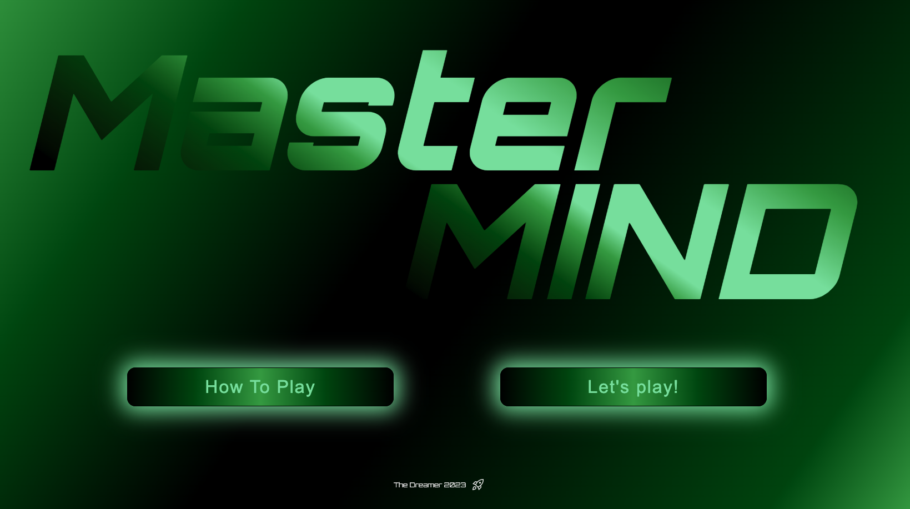
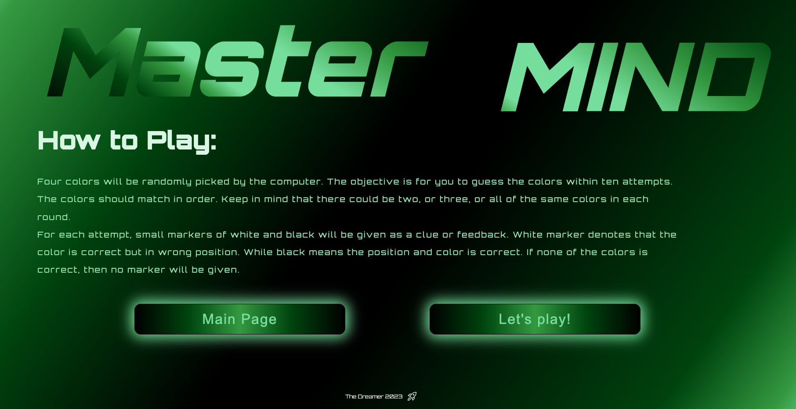
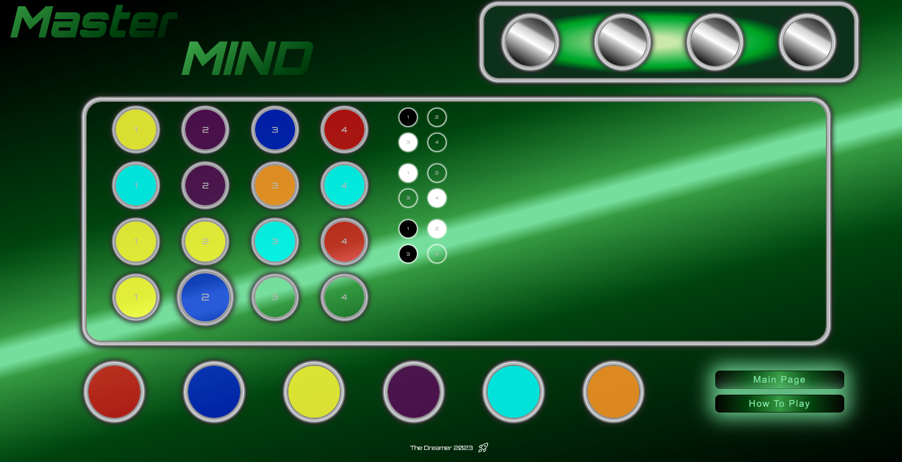
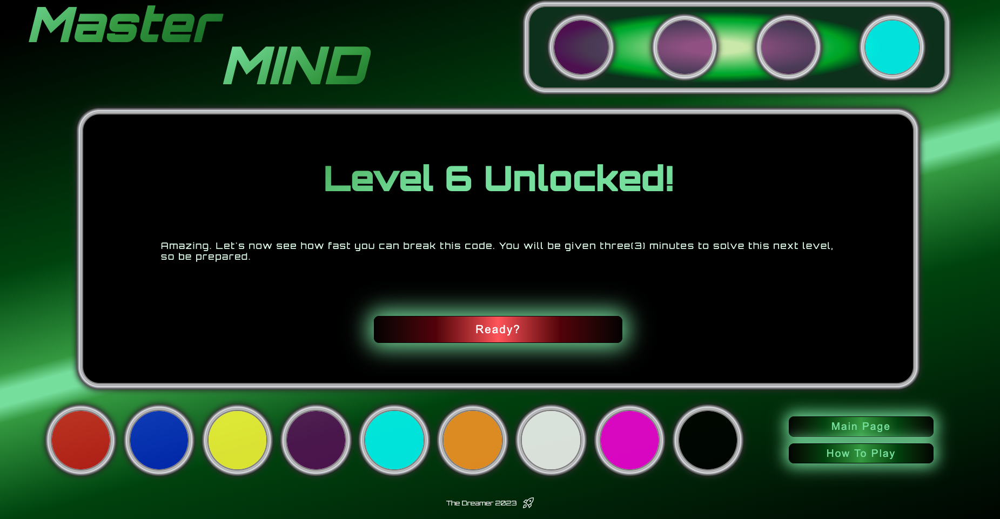

# Mastermind Game

Welcome to the Mastermind Game! This program offers a fun and challenging experience as you attempt to crack the secret code. The game consists of different levels, each with its own set of rules and challenges.

This interactive command-line program promises a delightful and intellectually stimulating experience as you embark on the journey to decipher the enigmatic code. The game is built using HTML, CSS, vanilla JavaScript, and select libraries. Moreover, the game boasts a responsive design that seamlessly adapts to both portrait and landscape mobile orientations for a versatile gaming experience.

## Table of Contents

1. Main Page
   

2. How to Play
   

3. Game Levels
   

## Main Page

The main page of the Mastermind Game provides you with links on how to play the game and start the game.

## How to Play

To play the Mastermind Game, follow these basic instructions:

1. **Guess the secret code:** The computer generates a secret code consisting of a sequence of colors.

2. **Make your guesses:** You have a limited number of attempts to guess the correct combination of colors.

3. **Receive feedback:** After each guess, you will receive feedback in the form of pegs. These pegs indicate the correctness of your guess.

   - In Level 1, the feedback pegs are in order, meaning they correspond to the positions of the correct colors in your guess.

   - In Level 3, the feedback pegs are no longer in order, making the game more challenging.

4. **Keep an eye on the timer:** In levels 6, 7, and 8, a timer is introduced to add an extra element of difficulty. You must solve the code within the given time limit.

5. **Level-specific rules:**
   - **Level 1:** Guess the 4-color code with 6 color choices and 10 attempts.
   - **Level 2:** Same as Level 1 but with 3 additional colors and 8 attempts.
   - **Level 3:** Same as Level 1 but with feedback pegs not in order.
   - **Level 4:** Same as Level 3 but with 8 attempts.
   - **Level 5:** Same as Level 4 but with 9 color choices.
   - **Level 6:** Same as Level 5 but with a 3-minute timer.
   - **Level 7:** Same as Level 6 but with a 2-minute timer.
   - **Level 8:** The most challenging level with a 1-minute timer.

## Game Levels

Each level offers a unique challenge, and as you progress to higher levels, the game becomes more demanding.

Remember that in some levels, the computer-generated code can include multiple instances of the same color or colors, making it even trickier to crack the code.

Have fun and test your code-breaking skills in the Mastermind Game! Good luck!
